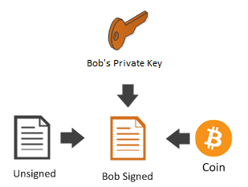

# Building Blocks
###### BostonHacks 2018 Stratis x FinTechBU Workshop: Writing a Transaction
#### Writing directly to chain


### Background
This workshop is designed for anyone with limited technical background. Your hand will be held through
* writing a custom multi-signature transaction
* broadcasting it to blockchain
Our ultimate goal is to team with partners and write a 2-of-3 multisignature transaction. We will discuss the scenarios where such a transaction and others may benefit organizations' financing

Huge thanks to @NicolasDorier, @nopara73, and everyone else who contributed to [Programming the Blockchain in C#](https://github.com/ProgrammingBlockchain/ProgrammingBlockchain). Much of this workshop draws from that text and the NBitcoin library Nicolas wrote which it details

# Let's get started

1) [Install .NET Core as documented here](https://www.microsoft.com/net/core#windowsvs2017).

2) [Install VSCode](https://code.visualstudio.com/download), or use Visual Studio, or your favorite text editor.
3) Install the [C# Extension](https://marketplace.visualstudio.com/items?itemName=ms-vscode.csharp) or other plugin for your editor like [omnisharp for sublime](https://github.com/OmniSharp/omnisharp-sublime). Without one making mistakes will be too easy.

**I highly recommend you type all of the commands and code rather than copy + paste. You'll more quickly get a feel for the library and be able to figure out where your mistakes are.**

# Create a new project

Enter the following commands in your command line:
```console
mkdir StratisProject
cd StratisProject
dotnet new console
dotnet add package NBitcoin
dotnet restore
```

Then edit Program.cs:
```cs
// Program.cs

using System;
using NBitcoin;

namespace StratisProject
{
    class Program
    {
        static void Main(string[] args)
        {
	    Network network = Network.TestNet;
	    var treasurer = new Key();

	    // Fun Fact: WIF is Wallet Imput Format - a base58 representation of your key
            Console.WriteLine("treasurer key: " +  treasurer.GetWif(network));

            var alice = new Key();
            var bob = new Key();

            Console.WriteLine("Alice     key: " + alice.GetWif(network));
            Console.WriteLine("Bob       key: " + bob.GetWif(network));
        }
    }
}
```
Run it in console:
```console
dotnet run
```
This program generates a 3 bitcoin secret keys (sk). Open a new file and **write them down**. We'll need them in the next steps.

```
// Keys.txt

// Just example keys. Yours will of course be actual base58 encoded WIF keys.
treasurer key: <cSMW1AvuqDX5NG3Gy4ktxx1yBWEKGU5r3p6NbXuCK6LkjtH12FLe>
Alice     key: <cSWyMTFYWBVjv7tzvpj1rQgMUwccs5yGgi9ZiHzP978nohWEDH9w>
Bob       key: <cUWedW9rd7HnsTdks1HDwUTTWRDsMvHz2kY6dbv5pH4jgHU1pN9H>
```

Substitute your keys **These keys won't work for you**. Replace your existing Main method with the following:

```cs
// Program.cs (Main method snipet)

static void Main(string[] args)
{
    Network network = Network.TestNet;
    // Replace the constructor argument with your own noted secrets from the last step
    var treasurer = new BitcoinSecret("cPaLw36GPtbfiq5rrEWsQLFn1oatdDmj8VRonnveEbFDctVAg5iy");
    var alice = new BitcoinSecret("cPaLw36GPtbfiq5rrEWsQLFn1oatdDmj8VRonnveEbFDctVAg5iy");
    var bob = new BitcoinSecret("cPaLw36GPtbfiq5rrEWsQLFn1oatdDmj8VRonnveEbFDctVAg5iy");

    Console.WriteLine("treasurer key: " + treasurer.PrivateKey.GetWif(network));
    Console.WriteLine("Alice     key: " + alice.PrivateKey.GetWif(network));
    Console.WriteLine("Bob       key: " + bob.PrivateKey.GetWif(network));
}
```

```console
dotnet run
```

>❔: When you run this program, is the WalletInputFormat sk logged the same? Why or why not?

# Writing a Multisig Transaction
Bitcoin allows us to have shared ownership over coins with multi-signature transactions or multi-sig for short.

In order to demonstrate this shared ownership we will create a ```ScriptPubKey``` that represents an **m-of-n multisig**. This means that in order to spend the coins, **m** number of private keys will be needed to sign the spending transaction out of the **n** number of different public keys provided.

Let’s create a multi-sig contract where two of the three Bob, Alice and our treasurer need to sign a transaction in order to spend a coin.  

```cs
// Program.cs
// Continued Main method:

var scriptPubKey = PayToMultiSigTemplate
    .Instance
    .GenerateScriptPubKey(2, new[] { bob.PubKey, alice.PubKey, treasurer.PubKey });

Console.WriteLine("PubKey script: " + scriptPubKey);
```  

Run it:
```console
dotnet run
```

The program now generates this script which you can use as a public key (coin destination address):
```
2 0282213c7172e9dff8a852b436a957c1f55aa1a947f2571585870bfb12c0c15d61 036e9f73ca6929dec6926d8e319506cc4370914cd13d300e83fd9c3dfca3970efb 0324b9185ec3db2f209b620657ce0e9a792472d89911e0ac3fc1e5b5fc2ca7683d 3 OP_CHECKMULTISIG
```  

As you can see, the ```scriptPubkey``` has the following form: ```<sigsRequired> <pubKeys…> <pubKeysCount> OP_CHECKMULTISIG```  

> [scriptPubKey](https://bitcoin.org/en/glossary/pubkey-script) is a Tx output which specifies conditions that must be satisfied in order to spend the value of the output. In this multi-sig transaction, we require 2-of-3 specified pubkeys to sign as condition to spend. 

### Notable Example [🔗](https://en.bitcoin.it/wiki/Multisignature#Notable_examples_in_practice)
>The cold storage wallet of the Bitfinex exchange is a single 3-of-6 multisig address `3D2oetdNuZUqQHPJmcMDDHYoqkyNVsFk9r` which as of November 2018 over [₿1,943,295](https://www.blockchain.com/btc/address/3D2oetdNuZUqQHPJmcMDDHYoqkyNVsFk9r) has flowed through ($12.3 billion). Presumably the keys are kept very safe by Bitfinex's operators. 

# P2SH 2-of-3 Transaction

This PubKey Script (scriptPubKey) we logged, though valid, doesn't look very much like a wallet-friendly address. We will run it through a function so a sender we use it like any other address.

```cs
// Program.cs (cont.)

var redeemScript = PayToMultiSigTemplate
    .Instance
    .GenerateScriptPubKey(2, new[] { bob.PubKey, alice.PubKey, treasurer.PubKey })
    .PaymentScript;

Console.WriteLine("redeemScript: "+ redeemScript);
```

Run it:
```console
dotnet run
```

And view the new output.
```
OP_HASH160 57b4162e00341af0ffc5d5fab468d738b3234190 OP_EQUAL
```  

This output hash represents the hash of the previous multi-sig script containing `OP_CHECKMULTISIG`

Since it's a hash, we can easily convert it to a base58 bitcoin address with the following snippet:

```cs
// Program.cs (cont.)

Console.WriteLine("multi-sig address:" + redeemScript.Hash.GetAddress(network));
```

> **Note**: Details are important. We pay to the `redeemScript.Hash` not the `redeemScript`. We want [P2SH](https://bitcoin.org/en/glossary/p2sh-address) not [P2PK[H]](https://bitcoin.org/en/glossary/p2pkh-address)

Excellent! Now we can load it up the same we would our FullNode wallet

# Give the script value 🤑

> ‼️ : The following parts of this guide include live transactions on the bitcoin network. If you send funds to the wrong place, they're gone forever. **Don't run the program unless you understand what it's doing.** Fret not; ask for help.

```console
dotnet run
```

Copy down your new `redeemScript.Hash` address. Enter it into this [bitcoin faucet](https://coinfaucet.eu/en/btc-testnet/) to get free coin for testing. If that's down here's the [backup faucet](http://bitcoinfaucet.uo1.net/)

Search the same **receive address** (`redeemScript.Hash` address) or **transactionId** (txId) on a [block explorer](https://testnet.smartbit.com.au/) to view the tx network status.


We're going to need some network connectivity to get funds out from now cold storage.

# Become a node (or a leech)
> Who runs a bitcoin node? [Send from your own node](https://programmingblockchain.gitbook.io/programmingblockchain/bitcoin_transfer/spend_your_coin#with-your-own-bitcoin-core).

Add `QBitNinja.Client` to your project:
```console
dotnet add package QBitNinja.Client
```
reference this nifty node-as-a-service at the top of `Program.cs`
```cs
// Program.cs
// ... after the other `using` statements

using QBitNinja.Client;

// ...
// Append to your `Program.cs` Main method
// ...

var client = new QBitNinjaClient(network);

// Replace "0acb..." with the txId from the block explorer from the faucet
// If the faucet doesn't work, look up the redeemScript.Hash address on the explorer
// You will find a txId related to that address. If no tx appears, try another faucet.

var receiveTransactionId = uint256.Parse("0acb6e97b228b838049ffbd528571c5e3edd003f0ca8ef61940166dc3081b78a");
var receiveTransactionResponse = client.GetTransaction(receiveTransactionId).Result;

Console.WriteLine(receiveTransactionResponse.TransactionId);
// if this fails, it's ok. It hasn't been confirmed in a block yet. Proceed
Console.WriteLine(receiveTransactionResponse.Block.Confirmations);
```

# Making a Payment 💸

Because our funds are locked in a 2-of-3 contract it (in order to be able to spend it) is a thus little more complicated than just calling ```Transaction.Sign```

Later we will talk more deeply on the subject but for now let’s use the ```TransactionBuilder``` to sign the transaction.

### From where?

Let's see which output of our transaction we can spend.
>❔: What does it mean to "spend" cryptocurrency?

```cs
// Program.cs (cont.)

var receivedCoins = receiveTransactionResponse.ReceivedCoins;
OutPoint outpointToSpend = null;
ScriptCoin coinToSpend = null;
foreach (var c in receivedCoins)
{
    try
    {
        // If we can make a ScriptCoin out of our redeemScript
        // we "own" this outpoint
        ScriptCoin coinToSpend = new ScriptCoin(c, redeemScript);
        outpointToSpend = c.Outpoint;
    }
    catch {}
}
if (outpointToSpend == null)
	throw new Exception("TxOut doesn't contain any our ScriptPubKey");
Console.WriteLine("We want to spend outpoint #{0}", outpointToSpend.N + 1);

var sendTransaction = Transaction.Create(network);
sendTransaction.Inputs.Add(new TxIn()
{
    PrevOut = outpointToSpend
});
```

### To who?
We already know Lucas's address is `mv4rnyY3Su5gjcDNzbMLKBQkBicCtHUtFB`


```cs
// Program.cs (cont.)

var lucasAddress = BitcoinAddress.Create("mv4rnyY3Su5gjcDNzbMLKBQkBicCtHUtFB", network);

```


> ‼️: We could sign & broadcast this transaction now. What's missing? Do we have a problem?

Typically we'd add a change output but lucas deserves all our bit wealth

# Signing the contract 🖋️

We need 2 of 3. Even if the treasurer doesn't approve, Alice & Bob'll have their way.

```cs
// Program.cs (cont.)

TransactionBuilder builder = network.CreateTransactionBuilder();
var minerFee = new Money(0.0002m, MoneyUnit.BTC);
var txInAmount = (Money)receivedCoins[(int)outpointToSpend.N].Amount;
```

> In practice, we would use a FullNode to estimate the miner fee. Since [we're rich](https://www.youtube.com/watch?v=rdkEUBmVJrc) we don't care.

```cs
// Program.cs (cont.)

Transaction unsigned =
    builder
        .AddCoins(coinToSpend)
	.Send(lucasAddress, txInAmount - minerFee)
	.SetChange(lucasAddress, ChangeType.Uncolored)
	.BuildTransaction(sign: false);

// Alice signs it
Transaction aliceSigned = 
    builder
        .AddCoins(coinToSpend)
        .AddKeys(alice)
        .SignTransaction(unsigned);

```
  

```cs
// Program.cs (cont.)

// Gotta get Bob's approval too
Transaction bobSigned =
    builder
        .AddCoins(coinToSpend)
	.AddKeys(bob)
	.SignTransaction(aliceSigned);
```

  

Now, Bob and Alice can combine their signatures into one transaction. This transaction will then be valid, because two signatures were used from the three (Bob, Alice and Satoshi) original signatures that were initially provided. The requirements of the 'two-of-three' multisig have therefore been met. If this wasn't the case, the network would not accept this transaction, because the nodes reject all unsigned or partially signed transactions.

```cs
// Program.cs (cont.)

Transaction fullySigned =
    builder
        .AddCoins(coinToSpend)
        .CombineSignatures(aliceSigned, bobSigned);

Console.WriteLine(fullySigned);
```  

  

Run it:
```console
dotnet run
```

Output:
```json
{
  ...
  "in": [
    {
      "prev_out": {
        "hash": "9df1e011984305b78210229a86b6ade9546dc69c4d25a6bee472ee7d62ea3c16",
        "n": 0
      },
      "scriptSig": "0 3045022100a14d47c762fe7c04b4382f736c5de0b038b8de92649987bc59bca83ea307b1a202203e38dcc9b0b7f0556a5138fd316cd28639243f05f5ca1afc254b883482ddb91f01 3044022044c9f6818078887587cac126c3c2047b6e5425758e67df64e8d682dfbe373a2902204ae7fda6ada9b7a11c4e362a0389b1bf90abc1f3488fe21041a4f7f14f1d856201"
    }
  ],
  "out": [
    {
      "value": "1.00000000",
      "scriptPubKey": "OP_DUP OP_HASH160 d4a0f6c5b4bcbf2f5830eabed3daa7304fb794d6 OP_EQUALVERIFY OP_CHECKSIG"
    }
  ]
}

```

The transaction is now ready to be sent to the network, but notice that the CombineSignatures() method was critical here, because both the aliceSigned and the bobSigned transactions were only partially signed, therefore not acceptable by the network. `CombineSignatures()` combined the two partially signed transactions into one fully signed transaction.  

# Broadcast it

Finally, let's send it to bitcoin nodes and get it in the blockchain

```cs
// Program.cs (cont.)

var broadcastResponse = client.Broadcast(sendTransaction).Result;
if (!broadcastResponse.Success)
{
    Console.Error.WriteLine("ErrorCode: " + broadcastResponse.Error.ErrorCode);
    Console.Error.WriteLine("Error message: " + broadcastResponse.Error.Reason);
}
else
{
    Console.WriteLine("Success! You can check out the hash of the transaciton in any block explorer:");
    Console.WriteLine(sendTransaction.GetHash());
}
```

```console
dotnet run
```

Congrats! Bask in your newfound glory 🥳🎉. You just deployed raw Bitcoin Script to the blockchain. It will be there forever!

